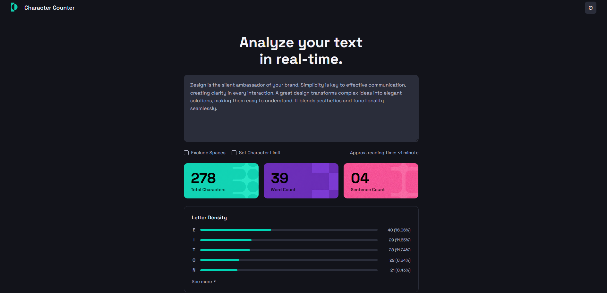
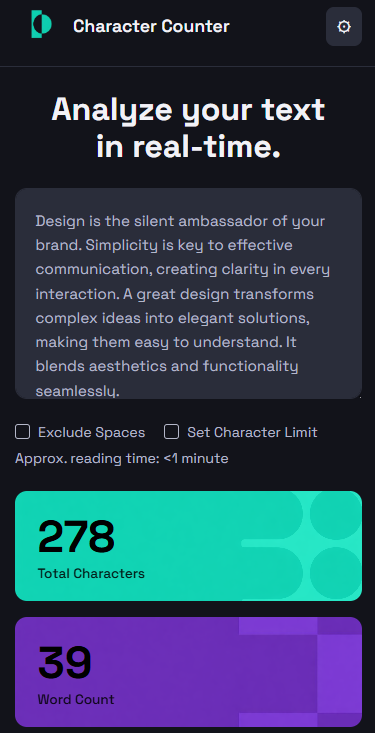
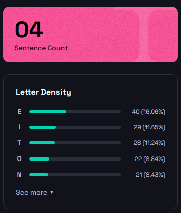
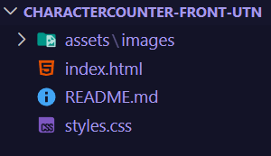

# Character Counter.

## 1. Objetivo del proyecto

Replicar visualmente el diseño de una interfaz web de conteo de caracteres utilizando únicamente HTML y CSS, sin JavaScript. El foco estuvo puesto en el maquetado semántico, el uso de Flexbox, diseño responsive y estilización avanzada con CSS.

## 2. Tecnologías utilizadas

- **HTML5** — estructura semántica 
- **CSS3** — estilos, Flexbox, variables CSS y responsive design
- **Google Fonts** — tipografía Space Grotesk
- **Remove.bg** — para remover el fondo del logo
- **Microsoft Copilot** — para la generación de las imágenes decorativas de las cards

## 3. Cómo organicé el HTML

El archivo `index.html` está dividido en dos grandes bloques:

- **`<header>`** — contiene el logo, el nombre del sitio y el botón de settings (⚙).
- **`<main>`** — contiene todas las secciones:
  - `.hero` — título principal y textarea
  - `.controls` — checkboxes y tiempo de lectura aproximado
  - `.cards` — tarjetas de métricas (Total Characters, Word Count, Sentence Count. Aclaración: Alt vacíos porque las imágenes son decorativas y no descriptivas)
  - `.density` — sección Letter Density con barras de progreso

Los comentarios en el HTML separan visualmente cada sección para facilitar la lectura del código.

## 4. Cómo resolví el CSS

El archivo `styles.css` está organizado en el siguiente órden:

1. Reset general (`*`)
2. Variables CSS (`:root`) — colores, tipografía y radios
3. Estilos del `body`
4. Estilos por sección en el mismo orden que el HTML
5. Media queries al final del archivo para responsive mobile

Utilicé una paleta de colores personalizada con tonos "tech" (teal, violeta y rosa), respetando el patrón del diseño original donde el color del logo, la primera card y las barras de Letter Density comparten el mismo color principal. Decidí cambiar los colores ya que en la clase fue acordado el permiso para diseño creativo.

Usé variables CSS para mantener consistencia en colores, bordes y radios a lo largo de todo el proyecto. También apliqué hover, border-radius, box-shadow y otras propiedades adicionales (position, transition, transform).

Las barras de progreso fueron implementadas con el elemento nativo `<progress>`, estilizado con pseudo-elementos específicos por navegador (`-webkit` para Chrome/Safari y `-moz` para Firefox) Aclaración: esto aparece comentado en el código de index.html y  styles.css, fue parte de la investigación de cómo resolverlo.

Los comentarios en el CSS separan cada sección visualmente.

## 5. Dificultades encontradas

- **Imágenes de fondo de las cards** — las imágenes decorativas tenían el color de fondo incluido, por lo que al intentar removerlo con Remove.bg el resultado no era el esperado. Lo resolví reemplazando las imágenes por versiones corregidas que incluían el diseño sobre el color correcto.

- **Ícono del botón "See more"** — el símbolo `v` no quedaba alineado verticalmente con el texto. Lo reemplacé por el triángulo Unicode `▼` con `font-size: 0.5rem`, lo que resolvió el problema de alineación. 

- **Símbolo `<` en el HTML** — al escribir `<1 minute` directamente en el HTML, el navegador lo interpretaba como una etiqueta y rompía el código. Es por eso que utilicé la entidad HTML `&lt;` que representa el símbolo `<` de forma segura. (Investigación)

## 6. Commits

Utilicé commits descriptivos y en órden a medida de que iba estructurando el HTML y estilando el mismo, con buenas prácticas que incluyeron palabras claves como feat, style, fix y docs.

## 7. Capturas del resultado final

### Vista desktop

### Vista mobile

### Estructura del proyecto en VSCode

#### Proyecto desarrollado por Sofía De Alessandre - Junio 2026.